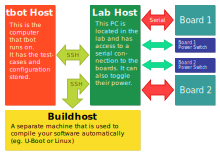

.. TBot documentation master file, created by
   sphinx-quickstart on Tue Aug 28 11:57:52 2018.
   You can adapt this file completely to your liking, but it should at least
   contain the root `toctree` directive.

Welcome to TBot's documentation!
================================

.. toctree::
   :maxdepth: 2
   :caption: Contents:

   install
   getting-started

Indices and tables
==================

* :ref:`genindex`
* :ref:`modindex`
* :ref:`search`
