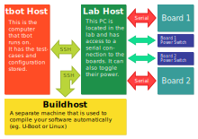

.. tbot documentation master file, created by
   sphinx-quickstart on Tue Jan 23 11:42:55 2018.
   You can adapt this file completely to your liking, but it should at least
   contain the root `toctree` directive.

Welcome to tbot's documentation!
================================

tbot is a test automation tool for embedded linux. The current version focuses on
support for U-Boot.

.. toctree::
   :maxdepth: 2
   :caption: Contents:

   doc/getting-started
   doc/configuration
   doc/logging
   doc/tbot
   doc/builtins
   doc/examples

Indices and tables
==================

* :ref:`genindex`
* :ref:`modindex`
* :ref:`search`
